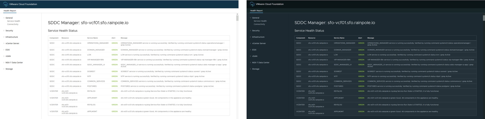

<!-- markdownlint-disable first-line-h1 no-inline-html -->

</br></br>

# PowerShell Module for VMware Cloud Foundation Reporting

[][module-reporting]&nbsp;&nbsp;
[][changelog]&nbsp;&nbsp;
[][module-reporting]&nbsp;&nbsp;

## Overview

`VMware.CloudFoundation.Reporting` is a PowerShell module that has been written to support the ability to provide insight to the operational state of VMware Cloud Foundation through the use of PowerShell cmdlets. These cmdlets provide quick access to information from the PowerShell console as well as the ability to publish pre-defined HTML reports.

## Requirements

### Platforms

- [VMware Cloud Foundation][vmware-cloud-foundation] 4.2.1 or later

### Operating Systems

- Microsoft Windows Server 2019 and 2022
- Microsoft Windows 10 and 11
- [VMware Photon OS][vmware-photon] 3.0 and 4.0

### PowerShell Editions and Versions

- [Microsoft Windows PowerShell 5.1][microsoft-powershell]
- [PowerShell Core 7.2.0 or later][microsoft-powershell]

### PowerShell Modules

- [`VMware.PowerCLI`][module-vmware-powercli] 12.7.0 or later
- [`VMware.vSphere.SsoAdmin`][module-vmware-vsphere-ssoadmin] 1.3.8 or later
- [`PowerVCF`][module-powervcf] 2.2.0 or later
- [`PowerValidatedSolutions`][module-powervalidatedsolutions] 2.0.0 or later

### Browsers

For the best experience, use one of the following browsers to view generated HTML reports.

- Microsoft Edge
- Google Chrome
- Mozilla Firefox

## Installing the Module

Verify that your system has a supported edition and version of PowerShell installed.

Install the supporting PowerShell modules from the PowerShell Gallery by running the following commands:

```powershell
Set-PSRepository -Name PSGallery -InstallationPolicy Trusted
Install-Module -Name VMware.PowerCLI -MinimumVersion 12.7.0
Install-Module -Name VMware.vSphere.SsoAdmin -MinimumVersion 1.3.8
Install-Module -Name PowerVCF -MinimumVersion 2.2.0
Install-Module -Name PowerValidatedSolutions -MinimumVersion 2.0.0
Install-Module -Name VMware.CloudFoundation.Reporting
```

If using VMware Photon OS, import the modules before proceeding:

For example:

```powershell
Import-Module -Name VMware.CloudFoundation.Reporting
```

To verify the modules are installed, run the following command in the PowerShell console.

```powershell
Test-VcfReportingPrereq
```

Once installed, any cmdlets associated with `VMware.CloudFoundation.Reporting` and the supporting PowerShell modules will be available for use.

To view the cmdlets for available in the module, run the following command in the PowerShell console.

```powershell
Get-Command -Module VMware.CloudFoundation.Reporting
```

To view the help for any cmdlet, run the `Get-Help` command in the PowerShell console.

For example:

```powershell
Get-Help -Name Invoke-VcfHealthReport
```

```powershell
Get-Help -Name Invoke-VcfHealthReport -Examples
```

## Updating the Module

Update the PowerShell module from the PowerShell Gallery by running the following commands:

```powershell
Update-Module -Name VMware.CloudFoundation.Reporting
```

To verify that the PowerShell module is updated, run the following command in the PowerShell console.

```powershell
Get-InstalledModule -Name VMware.CloudFoundation.Reporting
```

To verify that the dependencies meet the minimum requirements, run the following command in the PowerShell console.

```powershell
Test-VcfReportingPrereq
```

If a dependency does not meet the minimum requirements, run the appropriate `Update-Module` command for the dependency in the PowerShell console.

```powershell
Update-Module -Name VMware.PowerCLI
Update-Module -Name VMware.vSphere.SsoAdmin
Update-Module -Name PowerVCF
Update-Module -Name PowerValidatedSolutions
```

## User Access

Each cmdlet may provide one or more usage examples. Many of the cmdlets require that credentials are provided to output to the PowerShell console or a report.

The cmdlets in this module, and its dependencies, return data from multple platform components. The credentials for most of the platform components are returned to the cmdlets by retrieving credentials from the SDDC Manager inventory and using these credentials, as needed, within cmdlet operations.

For the best expereince, for cmdlets that connect to SDDC Manager, use the VMware Cloud Foundation API user `admin@local` or an account with the **ADMIN** role in SDDC Manager (e.g., `administrator@vsphere.local`).

## Getting Started with Reports

The PowerShell module provides the ability to generate the following reports:

- [Overview Report](#generating-system-overview-report-tasks)
- [Health Report](#generating-health-report-tasks)
- [Alert Report](#generating-system-alert-report-tasks)
- [Password Policy Report](#generating-password-policy-report-tasks)
- [Configuration Report](#generating-configuration-report-tasks)
- [Upgrade Precheck Report](#generating-upgrade-precheck-report-tasks)

Reports default to a light-mode theme. If you prefer a dark-mode theme, you can use the `-darkMode` parameter with each `Invoke-Vcf*Report` cmdlets. Each report is self-contained and will retain formatting if the resulting HTML output is shared.

Example:



### Generating System Overview Report Tasks

The `Invoke-VcfOverviewReport` cmdlet generates a system overview report. This report contains high-level information about the VMware Cloud Foundation system. This report may be used to provide a quick system overview of the system to your VMware representative.

#### Generate a System Overview Report for a VMware Cloud Foundation Instance

1. Start PowerShell (Run as Administrator).

2. Replace the values in the sample code with values for the instance of VMware Cloud Foundation to generate a system overview report for SDDC Manager instance and run the commands in the PowerShell console.

    **Example**: Windows

    ```powershell
    $sddcManagerFqdn = "sfo-vcf01.sfo.rainpole.io"
    $sddcManagerUser = "admin@local"
    $sddcManagerPass = "VMw@re1!VMw@re1!"

    $reportPath = "F:\Reporting"
    ```

    **Example**: Linux

    ```powershell
    $sddcManagerFqdn = "sfo-vcf01.sfo.rainpole.io"
    $sddcManagerUser = "admin@local"
    $sddcManagerPass = "VMw@re1!VMw@re1!"

    $reportPath = "/home/vmware/reporting"
    ```

3. Generate the report by running the command in the PowerShell console.

    ```powershell
    Invoke-VcfOverviewReport -sddcManagerFqdn $sddcManagerFqdn -sddcManagerUser $sddcManagerUser -sddcManagerPass $sddcManagerPass -reportPath $reportPath
    ```

    If you prefer to anonymize the data, you can use the `-anonymized` parameter.

    ```powershell
    Invoke-VcfOverviewReport -sddcManagerFqdn $sddcManagerFqdn -sddcManagerUser $sddcManagerUser -sddcManagerPass $sddcManagerPass -reportPath $reportPath -anonymized
    ```

4. Review the generated HTML report.

### Generating Health Report Tasks

The `Invoke-VcfHealthReport` cmdlet generates a health report. This report combines the SoS Utility health checks with additional health checks not presently available in the SoS Utility for previous VMware Cloud Foundation releases. The report contains detailed information about the health of the VMware Cloud Foundation system and its components.

#### Generate a Health Report for a VMware Cloud Foundation Instance (Display Only Issues)

1. Start PowerShell (Run as Administrator).

2. Replace the values in the sample code with values for the instance of VMware Cloud Foundation to generate a health report for SDDC Manager instance and run the commands in the PowerShell console.

    **Example**: Windows

    ```powershell
    $sddcManagerFqdn = "sfo-vcf01.sfo.rainpole.io"
    $sddcManagerUser = "admin@local"
    $sddcManagerPass = "VMw@re1!VMw@re1!"

    $sddcManagerRootPass = "VMw@re1!"
    $reportPath = "F:\Reporting"
    ```

    **Example**: Linux

    ```powershell
    $sddcManagerFqdn = "sfo-vcf01.sfo.rainpole.io"
    $sddcManagerUser = "admin@local"
    $sddcManagerPass = "VMw@re1!VMw@re1!"

    $sddcManagerRootPass = "VMw@re1!"
    $reportPath = "/home/vmware/reporting"
    ```

3. Generate the report which only displays issues by running the command in the PowerShell console.

    ```powershell
    Invoke-VcfHealthReport -sddcManagerFqdn $sddcManagerFqdn -sddcManagerUser $sddcManagerUser -sddcManagerPass $sddcManagerPass -sddcManagerRootPass $sddcManagerRootPass -reportPath $reportPath -allDomains -failureOnly
    ```

4. Review the generated HTML report and perform remediation of any identified issues.

#### Generate a Health Report for a Workload Domain (Display Only Issues)

1. Start PowerShell (Run as Administrator).

2. Replace the values in the sample code with values for the instance of VMware Cloud Foundation to generate a health report for SDDC Manager instance and run the commands in the PowerShell console.

    **Example**: Windows

    ```powershell
    $sddcManagerFqdn = "sfo-vcf01.sfo.rainpole.io"
    $sddcManagerUser = "admin@local"
    $sddcManagerPass = "VMw@re1!VMw@re1!"

    $sddcManagerRootPass = "VMw@re1!"
    $workloadDomain = "sfo-w01"
    $reportPath = "F:\Reporting"
    ```

    **Example**: Linux

    ```powershell
    $sddcManagerFqdn = "sfo-vcf01.sfo.rainpole.io"
    $sddcManagerUser = "admin@local"
    $sddcManagerPass = "VMw@re1!VMw@re1!"

    $sddcManagerRootPass = "VMw@re1!"
    $workloadDomain = "sfo-w01"
    $reportPath = "/home/vmware/reporting"
    ```

3. Generate the report which only displays issues by running the command in the PowerShell console.

    ```powershell
    Invoke-VcfHealthReport -sddcManagerFqdn $sddcManagerFqdn -sddcManagerUser $sddcManagerUser -sddcManagerPass $sddcManagerPass -sddcManagerRootPass $sddcManagerRootPass -reportPath $reportPath -workloadDomain $workloadDomain -failureOnly
    ```

4. Review the generated HTML report and perform remediation of any identified issues.

### Generate a Health Report for a VMware Cloud Foundation Instance

1. Start PowerShell (Run as Administrator).

2. Replace the values in the sample code with values for the instance of VMware Cloud Foundation to generate a health report for SDDC Manager instance and run the commands in the PowerShell console.

    **Example**: Windows

    ```powershell
    $sddcManagerFqdn = "sfo-vcf01.sfo.rainpole.io"
    $sddcManagerUser = "admin@local"
    $sddcManagerPass = "VMw@re1!VMw@re1!"

    $sddcManagerRootPass = "VMw@re1!"
    $reportPath = "F:\Reporting"
    ```

    **Example**: Linux

    ```powershell
    $sddcManagerFqdn = "sfo-vcf01.sfo.rainpole.io"
    $sddcManagerUser = "admin@local"
    $sddcManagerPass = "VMw@re1!VMw@re1!"

    $sddcManagerRootPass = "VMw@re1!"
    $reportPath = "/home/vmware/reporting"
    ```

3. Generate the report by running the command in the PowerShell console.

    ```powershell
    Invoke-VcfHealthReport -sddcManagerFqdn $sddcManagerFqdn -sddcManagerUser $sddcManagerUser -sddcManagerPass $sddcManagerPass -sddcManagerRootPass $sddcManagerRootPass -reportPath $reportPath -allDomains
    ```

4. Review the generated HTML report and perform remediation of any identified issues.

### Generate a Health Report for a Workload Domain

1. Start PowerShell (Run as Administrator).

2. Replace the values in the sample code with values for the instance of VMware Cloud Foundation to generate a health report for SDDC Manager instance and run the commands in the PowerShell console.

    **Example**: Windows

    ```powershell
    $sddcManagerFqdn = "sfo-vcf01.sfo.rainpole.io"
    $sddcManagerUser = "admin@local"
    $sddcManagerPass = "VMw@re1!VMw@re1!"

    $sddcManagerRootPass = "VMw@re1!"
    $workloadDomain = "sfo-w01"
    $reportPath = "F:\Reporting"
    ```

    **Example**: Linux

    ```powershell
    $sddcManagerFqdn = "sfo-vcf01.sfo.rainpole.io"
    $sddcManagerUser = "admin@local"
    $sddcManagerPass = "VMw@re1!VMw@re1!"

    $sddcManagerRootPass = "VMw@re1!"
    $workloadDomain = "sfo-w01"
    $reportPath = "/home/vmware/reporting"
    ```

3. Generate the report by running the command in the PowerShell console.

    ```powershell
    Invoke-VcfHealthReport -sddcManagerFqdn $sddcManagerFqdn -sddcManagerUser $sddcManagerUser -sddcManagerPass $sddcManagerPass -sddcManagerRootPass $sddcManagerRootPass -reportPath $reportPath -workloadDomain $workloadDomain
    ```

4. Review the generated HTML report and perform remediation of any identified issues.

### Generating System Alert Report Tasks

The `Invoke-VcfSystemAlertReport` cmdlet generates a system alert report. This report collects information about the system alerts that are currently active in the VMware Cloud Foundation system for the platform components. This report reduces the need to login to multiple product interfaces to collect information about the system alerts.

#### Generate a System Alert Report for a VMware Cloud Foundation Instance (Display Only Issues)

1. Start PowerShell (Run as Administrator).

2. Replace the values in the sample code with values for the instance of VMware Cloud Foundation to generate a system alert report for SDDC Manager instance and run the commands in the PowerShell console.

    **Example**: Windows

    ```powershell
    $sddcManagerFqdn = "sfo-vcf01.sfo.rainpole.io"
    $sddcManagerUser = "admin@local"
    $sddcManagerPass = "VMw@re1!VMw@re1!"

    $reportPath = "F:\Reporting"
    ```

    **Example**: Linux

    ```powershell
    $sddcManagerFqdn = "sfo-vcf01.sfo.rainpole.io"
    $sddcManagerUser = "admin@local"
    $sddcManagerPass = "VMw@re1!VMw@re1!"

    $reportPath = "/home/vmware/reporting"
    ```

3. Generate the report which only displays issues by running the command in the PowerShell console.

    ```powershell
    Invoke-VcfAlertReport -sddcManagerFqdn $sddcManagerFqdn -sddcManagerUser $sddcManagerUser -sddcManagerPass $sddcManagerPass -reportPath $reportPath -allDomains -failureOnly
    ```

4. Review the generated HTML report and perform remediation of any identified issues.

#### Generate a System Alert Report for a Workload Domain (Display Only Issues)

1. Start PowerShell (Run as Administrator).

2. Replace the values in the sample code with values for the instance of VMware Cloud Foundation to generate a system alert report for SDDC Manager instance and run the commands in the PowerShell console.

    **Example**: Windows

    ```powershell
    $sddcManagerFqdn = "sfo-vcf01.sfo.rainpole.io"
    $sddcManagerUser = "admin@local"
    $sddcManagerPass = "VMw@re1!VMw@re1!"

    $workloadDomain = "sfo-w01"
    $reportPath = "F:\Reporting"
    ```

    **Example**: Linux

    ```powershell
    $sddcManagerFqdn = "sfo-vcf01.sfo.rainpole.io"
    $sddcManagerUser = "admin@local"
    $sddcManagerPass = "VMw@re1!VMw@re1!"

    $workloadDomain = "sfo-w01"
    $reportPath = "/home/vmware/reporting"
    ```

3. Generate the report which only displays issues by running the command in the PowerShell console.

    ```powershell
    Invoke-VcfAlertReport -sddcManagerFqdn $sddcManagerFqdn -sddcManagerUser $sddcManagerUser -sddcManagerPass $sddcManagerPass -reportPath $reportPath -workloadDomain $workloadDomain -failureOnly
    ```

4. Review the generated HTML report and perform remediation of any identified issues.

#### Generate a System Alert Report for a VMware Cloud Foundation Instance

1. Start PowerShell (Run as Administrator).

2. Replace the values in the sample code with values for the instance of VMware Cloud Foundation to generate a system alert report for SDDC Manager instance and run the commands in the PowerShell console.

    **Example**: Windowa

    ```powershell
    $sddcManagerFqdn = "sfo-vcf01.sfo.rainpole.io"
    $sddcManagerUser = "admin@local"
    $sddcManagerPass = "VMw@re1!VMw@re1!"

    $reportPath = "F:\Reporting"
    ```

    **Example**: Linux

    ```powershell
    $sddcManagerFqdn = "sfo-vcf01.sfo.rainpole.io"
    $sddcManagerUser = "admin@local"
    $sddcManagerPass = "VMw@re1!VMw@re1!"

    $reportPath = "/home/vmware/reporting"
    ```

3. Generate the report by running the command in the PowerShell console.

    ```powershell
    Invoke-VcfAlertReport -sddcManagerFqdn $sddcManagerFqdn -sddcManagerUser $sddcManagerUser -sddcManagerPass $sddcManagerPass -reportPath $reportPath -allDomains
    ```

4. Review the generated HTML report and perform remediation of any identified issues.

#### Generate a System Alert Report for a Workload Domain

1. Start PowerShell (Run as Administrator).

2. Replace the values in the sample code with values for the instance of VMware Cloud Foundation to generate a system alert report for SDDC Manager instance and run the commands in the PowerShell console.

    **Example**: Windowa

    ```powershell
    $sddcManagerFqdn = "sfo-vcf01.sfo.rainpole.io"
    $sddcManagerUser = "admin@local"
    $sddcManagerPass = "VMw@re1!VMw@re1!"

    $workloadDomain = "sfo-w01"
    $reportPath = "F:\Reporting"
    ```

    **Example**: Linux

    ```powershell
    $sddcManagerFqdn = "sfo-vcf01.sfo.rainpole.io"
    $sddcManagerUser = "admin@local"
    $sddcManagerPass = "VMw@re1!VMw@re1!"

    $workloadDomain = "sfo-w01"
    $reportPath = "/home/vmware/reporting"
    ```

3. Generate the report by running the command in the PowerShell console.

    ```powershell
    Invoke-VcfAlertReport -sddcManagerFqdn $sddcManagerFqdn -sddcManagerUser $sddcManagerUser -sddcManagerPass $sddcManagerPass -reportPath $reportPath -workloadDomain $workloadDomain
    ```

4. Review the generated HTML report and perform remediation of any identified issues.

### Generating Password Policy Report Tasks

The `Invoke-VcfPasswordPolicyReport` cmdlet generates a password policy report. This report collects information about the password policy settings in a VMware Cloud Foundation system for the platform components. This report reduces the need to login to multiple product interfaces and endpoints to collect information about the password policy.

#### Generate a Password Policy Report for a VMware Cloud Foundation Instance

1. Start PowerShell (Run as Administrator).

2. Replace the values in the sample code with values for the instance of VMware Cloud Foundation to generate a password policy report for SDDC Manager instance and run the commands in the PowerShell console.

    **Example**: Windows

    ```powershell
    $sddcManagerFqdn = "sfo-vcf01.sfo.rainpole.io"
    $sddcManagerUser = "admin@local"
    $sddcManagerPass = "VMw@re1!VMw@re1!"

    $sddcManagerRootPass = "VMw@re1!"
    $reportPath = "F:\Reporting"
    ```

    **Example**: Linux

    ```powershell
    $sddcManagerFqdn = "sfo-vcf01.sfo.rainpole.io"
    $sddcManagerUser = "admin@local"
    $sddcManagerPass = "VMw@re1!VMw@re1!"

    $sddcManagerRootPass = "VMw@re1!"
    $reportPath = "/home/vmware/reporting"
    ```

3. Generate the report by running the command in the PowerShell console.

    ```powershell
    Invoke-VcfPasswordPolicy -sddcManagerFqdn $sddcManagerFqdn -sddcManagerUser $sddcManagerUser -sddcManagerPass $sddcManagerPass -reportPath $reportPath -allDomains
    ```

4. Review the generated HTML report.

#### Generate a Password Policy Report for a Workload Domain

1. Start PowerShell (Run as Administrator)

2. Replace the values in the sample code with values for the instance of VMware Cloud Foundation to generate a password policy report for SDDC Manager instance and run the commands in the PowerShell console.

    **Example**: Windows

    ```powershell
    $sddcManagerFqdn = "sfo-vcf01.sfo.rainpole.io"
    $sddcManagerUser = "admin@local"
    $sddcManagerPass = "VMw@re1!VMw@re1!"

    $sddcManagerRootPass = "VMw@re1!"
    $workloadDomain = "sfo-w01"
    $reportPath = "F:\Reporting"
    ```

    **Example**: Linux

    ```powershell
    $sddcManagerFqdn = "sfo-vcf01.sfo.rainpole.io"
    $sddcManagerUser = "admin@local"
    $sddcManagerPass = "VMw@re1!VMw@re1!"

    $sddcManagerRootPass = "VMw@re1!"
    $workloadDomain = "sfo-w01"
    $reportPath = "/home/vmware/reporting"
    ```

3. Generate the report by running the command in the PowerShell console.

    ```powershell
    Invoke-VcfPasswordPolicy -sddcManagerFqdn $sddcManagerFqdn -sddcManagerUser $sddcManagerUser -sddcManagerPass $sddcManagerPass -reportPath $reportPath -workloadDomain $workloadDomain
    ```

4. Review the generated HTML report.

### Generating Configuration Report Tasks

The `Invoke-VcfConfigurationReport` cmdlet generates a configuration report. This report collects information about the configuration settings in a VMware Cloud Foundation system for the platform components. This report reduces the need to login to multiple product interfaces and endpoints to collect information about the configuration.

#### Generate a Configuration Report for a VMware Cloud Foundation Instance

1. Start PowerShell (Run as Administrator).

2. Replace the values in the sample code with values for the instance of VMware Cloud Foundation to generate a configuration report for SDDC Manager instance and run the commands in the PowerShell console.

    **Example**: Windows

    ```powershell
    $sddcManagerFqdn = "sfo-vcf01.sfo.rainpole.io"
    $sddcManagerUser = "admin@local"
    $sddcManagerPass = "VMw@re1!VMw@re1!"

    $reportPath = "F:\Reporting"
    ```

    **Example**: Linux

    ```powershell
    $sddcManagerFqdn = "sfo-vcf01.sfo.rainpole.io"
    $sddcManagerUser = "admin@local"
    $sddcManagerPass = "VMw@re1!VMw@re1!"

    $reportPath = "/home/vmware/reporting"
    ```

3. Generate the report by running the command in the PowerShell console.

    ```powershell
    Invoke-VcfConfigReport -sddcManagerFqdn $sddcManagerFqdn -sddcManagerUser $sddcManagerUser -sddcManagerPass $sddcManagerPass -reportPath $reportPath -allDomains
    ```

4. Review the generated HTML report.

#### Generate a Configuration Report for a Workload Domain

1. Start PowerShell (Run as Administrator).

2. Replace the values in the sample code with values for the instance of VMware Cloud Foundation to generate a configuration report for SDDC Manager instance and run the commands in the PowerShell console.

    **Example**: Windows

    ```powershell
    $sddcManagerFqdn = "sfo-vcf01.sfo.rainpole.io"
    $sddcManagerUser = "admin@local"
    $sddcManagerPass = "VMw@re1!VMw@re1!"

    $workloadDomain = "sfo-w01"
    $reportPath = "F:\Reporting"
    ```

    **Example**: Linux

    ```powershell
    $sddcManagerFqdn = "sfo-vcf01.sfo.rainpole.io"
    $sddcManagerUser = "admin@local"
    $sddcManagerPass = "VMw@re1!VMw@re1!"

    $workloadDomain = "sfo-w01"
    $reportPath = "/home/vmware/reporting"
    ```

3. Generate the report by running the command in the PowerShell console.

    ```powershell
    Invoke-VcfConfigReport -sddcManagerFqdn $sddcManagerFqdn -sddcManagerUser $sddcManagerUser -sddcManagerPass $sddcManagerPass -reportPath $reportPath -workloadDomain $workloadDomain
    ```

4. Review the generated HTML report.

### Generating Upgrade Precheck Report Tasks

The upgrade precheck report, initiates an upgrade precheck of a workload domain using the REST API and presents the results in an HTML report. This allows you to start the precheck from the PowerShell console.

#### Perform an Upgrade Precheck for a Workload Domain

1. Start PowerShell (Run as Administrator).

2. Replace the values in the sample code with values for the instance of VMware Cloud Foundation to generate an upgrade precheck report for SDDC Manager instance and run the commands in the PowerShell console.

    **Example**: Windows

    ```powershell
    $sddcManagerFqdn = "sfo-vcf01.sfo.rainpole.io"
    $sddcManagerUser = "admin@local"
    $sddcManagerPass = "VMw@re1!VMw@re1!"

    $workloadDomain = "sfo-w01"
    $reportPath = "F:\Reporting"
    ```

    **Example**: Linux

    ```powershell
    $sddcManagerFqdn = "sfo-vcf01.sfo.rainpole.io"
    $sddcManagerUser = "admin@local"
    $sddcManagerPass = "VMw@re1!VMw@re1!"

    $workloadDomain = "sfo-w01"
    $reportPath = "/home/vmware/reporting"
    ```

3. Generate the report by running the command in the PowerShell console.

    ```powershell
    Invoke-VcfUpgradePrecheck -sddcManagerFqdn $sddcManagerFqdn -sddcManagerUser $sddcManagerUser -sddcManagerPass $sddcManagerPass -reportPath $reportPath -workloadDomain $workloadDomain
    ```

4. Review the generated HTML report.

## Contributing

The project team welcomes contributions from the community. Before you start working with PowerValidatedSolutions, please
read our [Developer Certificate of Origin][vmware-cla-dco]. All contributions to this repository must be
signed as described on that page. Your signature certifies that you wrote the patch or have the right to pass it on
as an open-source patch.

For more detailed information, refer to the [contribution guidelines][contributing] to get started.

## Support

This PowerShell module is not supported by VMware Support.

We welcome you to use the GitHub [issues][issues] tracker to report bugs or suggest features and enhancements.

When filing an issue, please check existing open, or recently closed, issues to make sure someone else hasn't already
reported the issue.

Please try to include as much information as you can. Details like these are incredibly useful:

- A reproducible test case or series of steps.
- Any modifications you've made relevant to the bug.
- Anything unusual about your environment or deployment.

## License

Copyright 2022-2023 VMware, Inc.

Redistribution and use in source and binary forms, with or without modification, are permitted provided that the following conditions are met:

1. Redistributions of source code must retain the above copyright notice, this list of conditions and the following disclaimer.

2. Redistributions in binary form must reproduce the above copyright notice, this list of conditions and the following disclaimer in the documentation and/or other materials provided with the distribution.

THIS SOFTWARE IS PROVIDED BY THE COPYRIGHT HOLDERS AND CONTRIBUTORS "AS IS" AND ANY EXPRESS OR IMPLIED WARRANTIES, INCLUDING, BUT NOT LIMITED TO, THE IMPLIED WARRANTIES OF MERCHANTABILITY AND FITNESS FOR A PARTICULAR PURPOSE ARE DISCLAIMED. IN NO EVENT SHALL THE COPYRIGHT HOLDER OR CONTRIBUTORS BE LIABLE FOR ANY DIRECT, INDIRECT, INCIDENTAL, SPECIAL, EXEMPLARY, OR CONSEQUENTIAL DAMAGES (INCLUDING, BUT NOT LIMITED TO, PROCUREMENT OF SUBSTITUTE GOODS OR SERVICES; LOSS OF USE, DATA, OR PROFITS; OR BUSINESS INTERRUPTION) HOWEVER CAUSED AND ON ANY THEORY OF LIABILITY, WHETHER IN CONTRACT, STRICT LIABILITY, OR TORT (INCLUDING NEGLIGENCE OR OTHERWISE) ARISING IN ANY WAY OUT OF THE USE OF THIS SOFTWARE, EVEN IF ADVISED OF THE POSSIBILITY OF SUCH DAMAGE.

[//]: Links

[changelog]: CHANGELOG.md
[contributing]: CONTRIBUTING_DCO.md
[issues]: https://github.com/vmware/powershell-module-for-vmware-cloud-foundation-reporting/issues
[microsoft-powershell]: https://docs.microsoft.com/en-us/powershell
[module-vmware-powercli]: https://www.powershellgallery.com/packages/VMware.PowerCLI
[module-vmware-vsphere-ssoadmin]: https://www.powershellgallery.com/packages/VMware.vSphere.SsoAdmin
[module-powervcf]: https://www.powershellgallery.com/packages/PowerVCF/2.2.0
[module-reporting]: https://www.powershellgallery.com/packages/VMware.CloudFoundation.Reporting
[module-powervalidatedsolutions]: https://www.powershellgallery.com/packages/PowerValidatedSolutions
[vmware-photon]: https://vmware.github.io/photon/
[vmware-cla-dco]: https://cla.vmware.com/dco
[vmware-cloud-foundation]: https://docs.vmware.com/en/VMware-Cloud-Foundation
